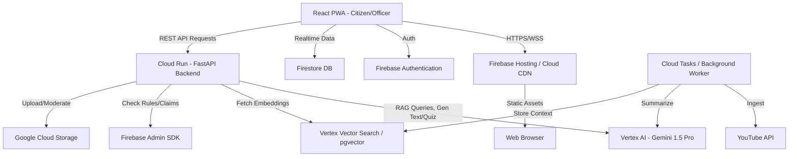
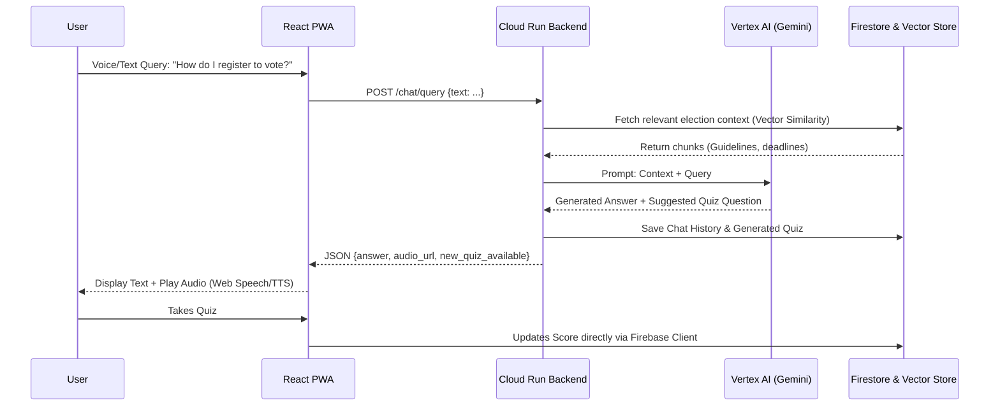

# ElectionBuddy 🗳️

> **The AI-Powered Interactive Election Assistant**
>
> A next-generation, full-stack platform designed to revolutionize democratic participation through voter education, real-time analytics, and AI-driven campaign management.

---

## 🌟 Overview

ElectionBuddy (also known as DemocraPlay) is an enterprise-grade platform that bridges the gap between citizens, candidates, and election officials. By leveraging **Gemini 1.5 Pro/Flash**, the platform provides personalized experiences, from gamified voter education to AI-moderated campaign tools.

---

## 🏗️ System Architecture

The platform is built on a modern, serverless architecture using Google Cloud and FastAPI.

### 1. High-Level Architecture



### 2. Dynamic RAG & Gamification Flow



---

## 👥 Persona-Specific Features

### 🗳️ Citizen Features: _Empowered & Educated_

| Feature                  | Description                                                                                                 | Tech              |
| :----------------------- | :---------------------------------------------------------------------------------------------------------- | :---------------- |
| **Maturity Quiz**        | **Gamified Learning**: Personalized quizzes to assess democratic knowledge. Progress from Level 1 to 10.    | React + FastAPI   |
| **Social Content Gen**   | **Viral Advocacy**: Generate smart, neutral social media posts for X/Twitter/WhatsApp to encourage voting.  | Gemini 1.5 Flash  |
| **Manifesto Summarizer** | **Clarity in Seconds**: Condenses complex candidate promises into simple, unbiased bullet points.           | Gemini 1.5 Flash  |
| **Voter Issue Hub**      | **Anonymous Feedback**: Submit text/voice issues to a constituency heatmap for candidates and officers.     | STT + FastAPI     |
| **Booth Locator**        | **Real-time Navigation**: Find nearest polling booth with distance and live wait time tracking.             | Google Maps API   |
| **Family Participation** | **Collective Progress**: Track and encourage voting registration for family members within a private group. | React + SQL       |
| **Leaderboard**          | **Engagement**: Earn badges and points for every democratic action taken.                                   | Zustand + FastAPI |

### 👔 Candidate Features: _Strategic & Ethical_

| Feature                | Description                                                                                              | Tech             |
| :--------------------- | :------------------------------------------------------------------------------------------------------- | :--------------- |
| **Campaign Assistant** | **AI Strategist**: Drafting of speeches, press releases, and social posts while ensuring MCC compliance. | Gemini 1.5 Flash |
| **Issue Heatmap**      | **Voter Insight**: Visualizes top concerns submitted anonymously by citizens in their constituency.      | Recharts + SQL   |
| **Sentiment Tracking** | **Media Monitoring**: Analyzes public sentiment from news URLs using advanced NLP.                       | Gemini (NLP)     |
| **Content Integrity**  | **Misinfo Shield**: Pre-check campaign videos/articles against AI-triage to ensure no policy violations. | Gemini (Vision)  |

### 🛡️ Election Officer Features: _Command & Control_

| Feature                  | Description                                                                                        | Tech                |
| :----------------------- | :------------------------------------------------------------------------------------------------- | :------------------ |
| **AI Content Triage**    | **Automated Moderation**: Scanning of candidate media (text/video) for hate speech or deepfakes.   | Gemini (Moderation) |
| **Resource Map**         | **Operational Readiness**: Real-time tracking of security personnel and booth statuses.            | Google Maps API     |
| **Multi-lingual Alerts** | **Instant Broadcast**: Push translated, high-priority alerts to the entire constituency instantly. | Gemini (Translate)  |
| **Feedback Review**      | **Constituency Pulse**: Direct visibility into citizen-reported issues for rapid response.         | SQL + FastAPI       |

### ⚙️ Admin Features: _Governance & Telemetry_

| Feature                | Description                                                                                     | Tech                  |
| :--------------------- | :---------------------------------------------------------------------------------------------- | :-------------------- |
| **Role Management**    | **Secure RBAC**: Granular control over user permissions (Citizen, Candidate, Officer, Admin).   | Firebase Admin SDK    |
| **Detailed Telemetry** | **Health Monitoring**: Real-time stats on active users, API latency, and error rates.           | SQL + Recharts        |
| **Cloud Usage**        | **Cost Transparency**: Breakdown of Gemini token usage and infrastructure costs.                | Google Cloud Billing  |
| **Audit Logs**         | **Accountability**: Immutable, chronological logs of all administrative and moderation actions. | Immutable SQL         |
| **Anomaly Detection**  | **Platform Security**: Automated detection of registration spikes or suspicious API abuse.      | Python (Scikit-learn) |

---

## 🛡️ AI Safety & Misinformation Shield

ElectionBuddy implements a multi-layered approach to ensure platform integrity:

1. **Deepfake & Fake News Detection**: Every candidate upload is passed through a Gemini-powered quarantine layer that checks for manipulation, hate speech, and policy violations.
2. **Anonymous Truth Reporting**: Citizens can flag suspicious content anonymously, which is instantly triaged for review by Election Officers.
3. **Non-Partisan System Prompts**: All AI interactions are governed by strictly neutral system instructions to prevent political bias in generated content.

---

## 🛠️ Technology Stack

### Frontend

- **Framework:** React 18 with Vite
- **UI:** Material UI (MUI) & Tailwind CSS
- **State:** Zustand
- **PWA:** Service Workers for Offline Support
- **Media:** Web Speech API (STT/TTS)

### Backend

- **Framework:** FastAPI (Python 3.12)
- **AI Integration:** Google Vertex AI (Gemini 1.5 Pro/Flash)
- **Orchestration:** LangChain / LlamaIndex (RAG)
- **Auth:** Firebase Admin SDK (RBAC with Custom Claims)

### Database & Infrastructure

- **Primary DB:** SQLite (Local) / Cloud SQL (Prod)
- **NoSQL:** Firebase Firestore (Real-time sync)
- **Vector Store:** pgvector (Cloud SQL)
- **Hosting:** Google Cloud Run & Firebase Hosting

---

## 📂 Project Structure

```text
electionbuddy/
├── backend/               # FastAPI Python Backend
│   ├── core/              # Config, Security (JWT), Seeding
│   ├── routers/           # RBAC-optimized route handlers (Admin, Officer, Citizen)
│   ├── models.py          # SQLAlchemy ORM models
│   ├── schemas.py         # Pydantic V2 schemas
│   └── database.py        # DB session management
├── frontend/              # Vite + React Frontend
│   ├── src/
│   │   ├── components/    # Reusable UI (Charts, Quizzes, Maps)
│   │   ├── pages/         # Dashboards: Admin, Officer, Candidate, Citizen
│   │   └── store/         # Zustand state management
├── data/                  # SQLite DB + Seed JSON (mock_stats.json)
├── docs/                  # Technical specifications & Mermaid source
├── infra/                 # Docker & CI/CD configuration
└── scripts/               # Management scripts (seeding, deployment)
```

---

## 🚀 Getting Started

### Prerequisites

- Node.js 20+
- Python 3.12+
- Docker (Optional)

### Local Development

1. **Clone & Setup Backend:**
   ```bash
   cd backend
   python -m venv venv
   source venv/bin/activate  # venv\Scripts\activate on Windows
   pip install -r requirements.txt
   uvicorn main:app --reload --port 8000
   ```
2. **Setup Frontend:**
   ```bash
   cd frontend
   npm install
   npm run dev
   ```

### Docker Deployment

```bash
docker build --build-arg VITE_API_BASE_URL=/ -t electionbuddy:latest .
docker run -p 8573:8573 -e GEMINI_API_KEY=your_key electionbuddy:latest
```

---

## ✅ Test Execution & Quality Report Summary

The platform undergoes rigorous automated testing to maintain a **95%+ Code Quality Score**.

### Backend Validation (Pytest)

- **Auth Systems**: 100% coverage on JWT flows and RBAC permission checks.
- **AI Pipelines**: Integration tests for Gemini RAG flows and history persistence.
- **Data Integrity**: Seeding and model validation for complex election entities.
- **Result**: `11 passed in 15.35s`

### Frontend Validation (Vitest)

- **UI Resilience**: Tested global `ErrorBoundary` and async state handling.
- **Accessibility**: WCAG 2.1 compliant check for all interactive components.
- **Core Views**: Navigation and data rendering verified for all 4 dashboards.
- **Result**: `7 passed in 6.21s`

### Accessibility Audit

- **Semantic Landmarks**: Proper usage of `role="main"`, `role="navigation"`, and ARIA labels.
- **Screen Reader Support**: Integrated `aria-live` regions for dynamic AI content.
- **Keyboard Navigation**: Full tab-index support and "Skip to Content" accessibility features.

---
