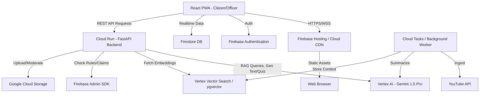
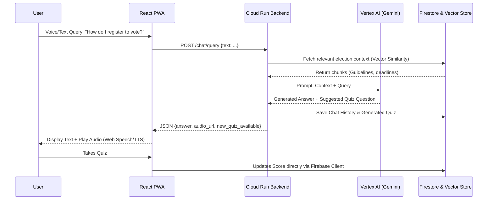
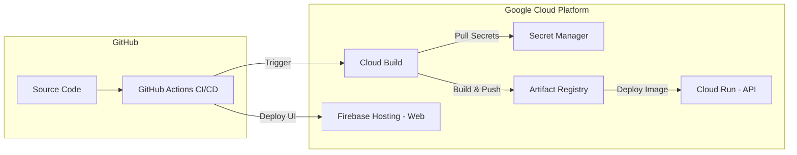
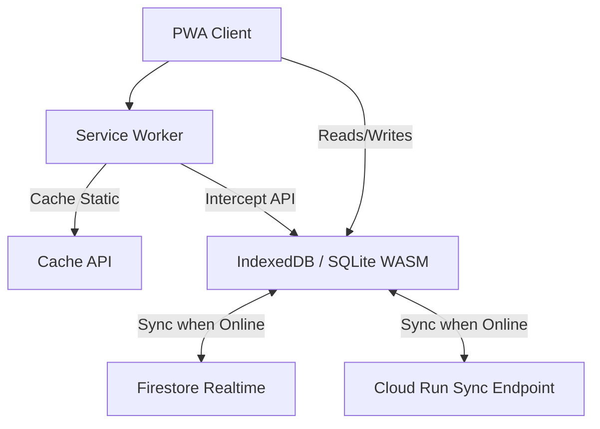
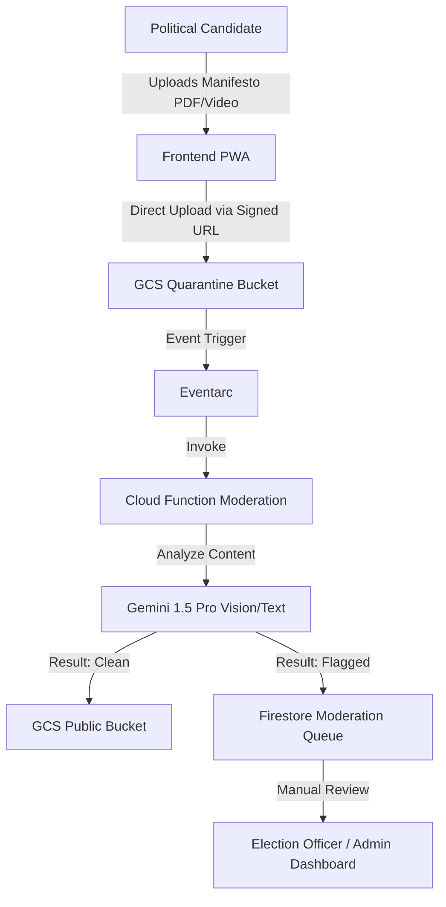

# System Architecture

## 1. High-Level System Architecture

## 2. Dynamic RAG & Gamification Flow

## 3. Deployment Architecture

## 4. Offline Sync Architecture (PWA)

## 5. Security & Moderation Flow

